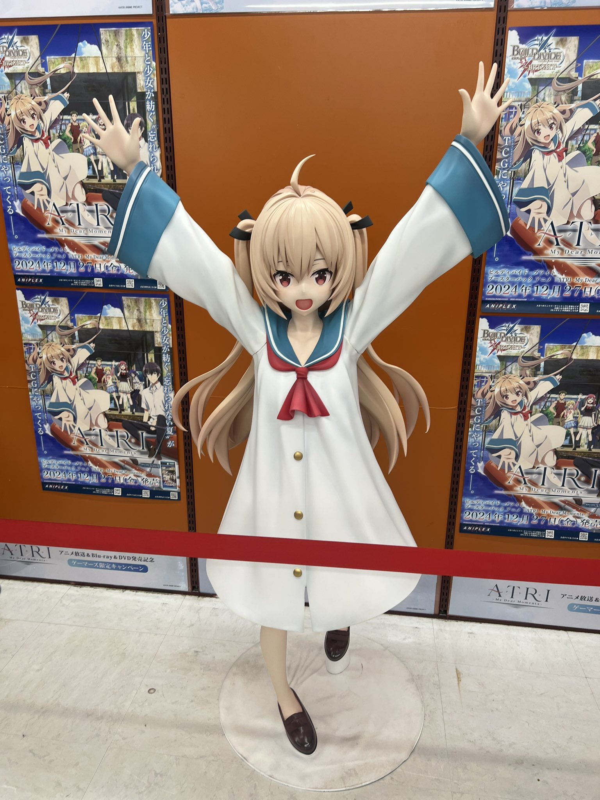

<link rel="stylesheet" href="./travels.css" />

# ATRI: My Dear Moments
Both the [anime](https://anilist.co/anime/154963/ATRI-My-Dear-Moments) and [visual novel](https://vndb.org/v27448) locations

??? note "Blu-ray Release Exhibitions"
    The following are images from around the release of Blu-ray discs.
    <h3>Akihabara Gamers</h3>
    

      <figure>
        
        <figcaption>Original</figcaption>
      </figure>
      <figure>
        
        <figcaption>Original</figcaption>
      </figure>
      <figure>
        
        <figcaption>Twitter</figcaption>
      </figure>
      <figure>
        
        <figcaption>Twitter</figcaption>
      </figure>
    

    I was able to get a few images, but I had to leave early at the start of the exhibition
    to get as many photo of Choshi as I could and then when I came back to Tokyo again,
    only the signboard and elevator was left...

    <h3>Den Den Town, Osaka</h3>
    

      <figure>
        
        <figcaption>Original</figcaption>
      </figure>
      <figure>
        
        <figcaption>Original</figcaption>
      </figure>
    

    <h3>Nagoya Softmap</h3>
    <figure>
      
      <figcaption>Twitter</figcaption>
    </figure>

## Map
<iframe src="https://www.google.com/maps/d/u/0/embed?mid=1KEnbHTSlb0lKALzkqKzuQvwMtPBmpGM&ehbc=2E312F"></iframe>

## Choshi, Chiba

### Reccomended Itinerary
<figure class="inline">
  
  <figcaption>Original</figcaption>
</figure>
Estimated length: 2 days (average), 1 day (minimum)

To get to Choshi, you must head to Choshi station first then take a train backwards
to the west most station(1) and then go to the temple before reaching the next station.
From there, take the train to Choshi station again and get your rental bike to reach
every other spot. The Aeon mall spot(2) has no easy public transport access so it's 
still best to head there using the bike. Trains from Tokyo open around 5am, and the 
first trains should reach Choshi around 9am, with the last trains to Tokyo around 6pm.
With your best efforts, it is possible to reach every location without having to stay
the night in Choshi.

<h3>Shiishiba Station</h3>

  <figure>
    
    <figcaption>Anime</figcaption>
  </figure>
  <figure>
     
     <figcaption>Original</figcaption>
  </figure>

<h3>Unakami Hachimangū</h3>

  <figure>
    
    <figcaption>Anime</figcaption>
  </figure>
  <figure>
     
     <figcaption>Original</figcaption>
  </figure>

??? note "Mamori and Other Goods"
    <figure class="inline"> 
      
      <figcaption>Original</figcaption>
    </figure>
    According to the city website, you need a reservation since this is not always
    staffed. There's also a nearby walking trail with another gate at the end
    of the path.

??? note "Next Time"
    - Don't forget to reserve a bike
    - Try to get mamori, which requires reservation
    - Lunch at cafe
        - Try to redo photo
    - Missing spots, Aeon Mall, Windmill shots
    - Checking more anime frames

## Dotonbori, Osaka
<h3>Kani Doraku Dotonbori Main Branch</h3>

  <figure>
    
    <figcaption>Anime</figcaption>
  </figure>
  <figure>
     
     <figcaption>Original</figcaption>
  </figure>

There's two crabs on the same street but go for the one on the corner of the main
Dotonbori street to get more correct photo.

??? failure "Incorrect Crab"
    <figure class="inline"> 
      
      <figcaption>Original</figcaption>
    </figure>
    The space above the crab is the giveaway between the two locations. Moreover,
    the locations are only a 5 min walk so finding the correct location should be simple.

## Ashikita, Kumamoto
<h3>Akasaki Elementary School (Incomplete)</h3>

  <figure>
    
    <figcaption>Game CG</figcaption>
  </figure>
  <figure>
    
    <figcaption>Twitter</figcaption>
  </figure>

This isn't quite the exact same image, but close enough to care about and consider 
as an inspiration. Also, the school seems to be closed, but there has been posts about
going inside as late as 2023.
<a class="footnote-ref" style="margin-left: -10px;" href="#sources">&#8595;</a>

??? note "Next Time"
    - Get lots of shots like [this](https://togetter.com/li/2093392)

## Sources
- Base Google Maps
    - [https://www.google.com/maps/...](https://www.google.com/maps/d/u/0/edit?mid=1KEnbHTSlb0lKALzkqKzuQvwMtPBmpGM&ll=35.7084884362651%2C140.84304807604605&z=16)
    - [https://togetter.com/li/2412976](https://togetter.com/li/2412976)
- Lots of additional notes
    - [https://ajin-movie.com/atri-seitijyunrei/](https://ajin-movie.com/atri-seitijyunrei/)
    - [https://musubi10.com/atri-seichi/](https://musubi10.com/atri-seichi/)
    - [https://x.com/negima105/status/1863923959496065363/photo/1](https://x.com/negima105/status/1863923959496065363/photo/1)
    - [https://x.com/sasakure_op/status/1844901986250244526?t=KqXZzIRe5nbh4GOfvtmmFg&s=19](https://x.com/sasakure_op/status/1844901986250244526?t=KqXZzIRe5nbh4GOfvtmmFg&s=19)
- Found the original game hill here
    - [https://note.com/omiyayimo/n/n51509bfd1bff](https://note.com/omiyayimo/n/n51509bfd1bff)
- Even larger Google Maps
    - [https://www.google.com/maps/...](https://www.google.com/maps/@34.027246,130.374609,6z/data=!4m3!11m2!2spOhqNCsyqsB64nsiwYTUXVwNRiPNmA!3e3?entry=ttu&g_ep=EgoyMDI0MTIxMS4wIKXMDSoASAFQAw%3D%3D)
    - [https://x.com/karuha_hrflute9/status/1814686956485550362](https://x.com/karuha_hrflute9/status/1814686956485550362)
- ATRI in Kyushu ref materials
    - [https://togetter.com/li/2093392](https://togetter.com/li/2093392)
