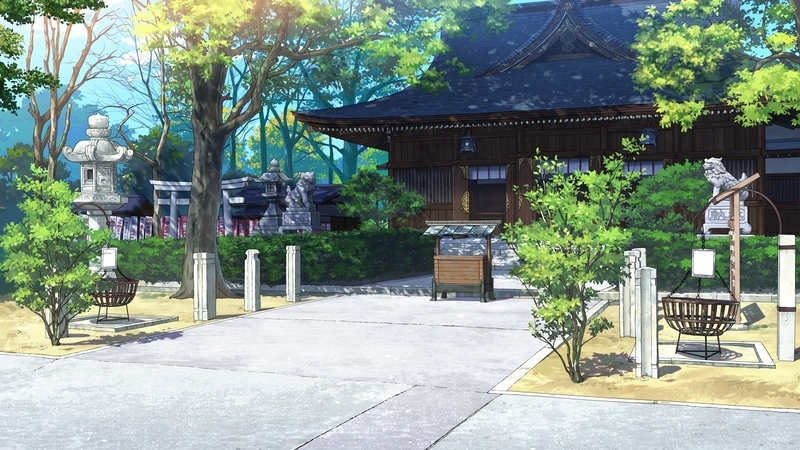

<link rel="stylesheet" href="./travels.css" />
# Café Stella and the Reapers' Butterflies
Café Stella and the Reapers' Butterflies [visual novel](https://vndb.org/v26414) IRL locations w/ tips
about traveling to the IRL locations.

## Google Map
<iframe src="https://www.google.com/maps/d/u/0/embed?mid=1HiYRcJ0oCtz5oT3verLOnB80237zzbw&ehbc=2E312F" width="640" height="480"></iframe>

## Nagoya
### Reccomended Itinerary
Estimated length: 1 days

Getting both the Nagoya and Osaka shots within 1 day is completely possible. There
are both Willer bus, express train, and Shinkansen routes between Nagoya and Osaka.

### Nagoya Station

  <figure>
    
    <figcaption>Game CG</figcaption>
  </figure>
  <figure>
    
    <figcaption>Original</figcaption>
  </figure>

### Hijiechou Street

  <figure>
    
    <figcaption>Game CG</figcaption>
  </figure>
  <figure>
    
    <figcaption>Original</figcaption>
  </figure>

### Otsu Street

  <figure>
    
    <figcaption>Game CG</figcaption>
  </figure>
  <figure>
    
    <figcaption>Original</figcaption>
  </figure>

??? note "Otsu Area"
    <figure class="inline"> 
      
      <figcaption>Original</figcaption>
    </figure>
    The Otsu area is a mini otaku district within Nagoya. On the day I went, there
    was an idol street performance. If you are interested in local visual novel stores 
    check out this other [map](https://www.google.com/maps/d/u/0/edit?mid=1vPoERq7wcgHiZpHcuX5IzLwrO1Dfn88).

### Wakamiya Hachimansha Shrine

  <figure>
    
    <figcaption>Game CG</figcaption>
  </figure>
  <figure>
    
    <figcaption>Original</figcaption>
  </figure>

### Nadya Park

  <figure>
    
    <figcaption>Game CG</figcaption>
  </figure>
  <figure>
    
    <figcaption>Original</figcaption>
  </figure>

Previously, there was a yellow Loft store, but that closed around 2023 and now 
the replacement store is blue.

## Osaka
### Osaka University

  <figure>
    
    <figcaption>Game CG</figcaption>
  </figure>
  <figure>
    
    <figcaption>Original</figcaption>
  </figure>

### Universal Studios

  <figure>
    
    <figcaption>Game CG</figcaption>
  </figure>
  <figure>
    
    <figcaption>Original</figcaption>
  </figure>

## Sources
- [https://rinnow.hatenablog.com/entry/stella](https://rinnow.hatenablog.com/entry/stella)
