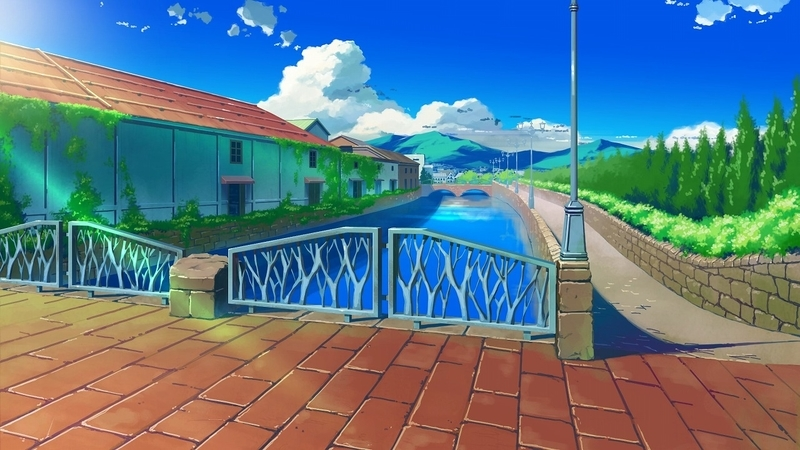
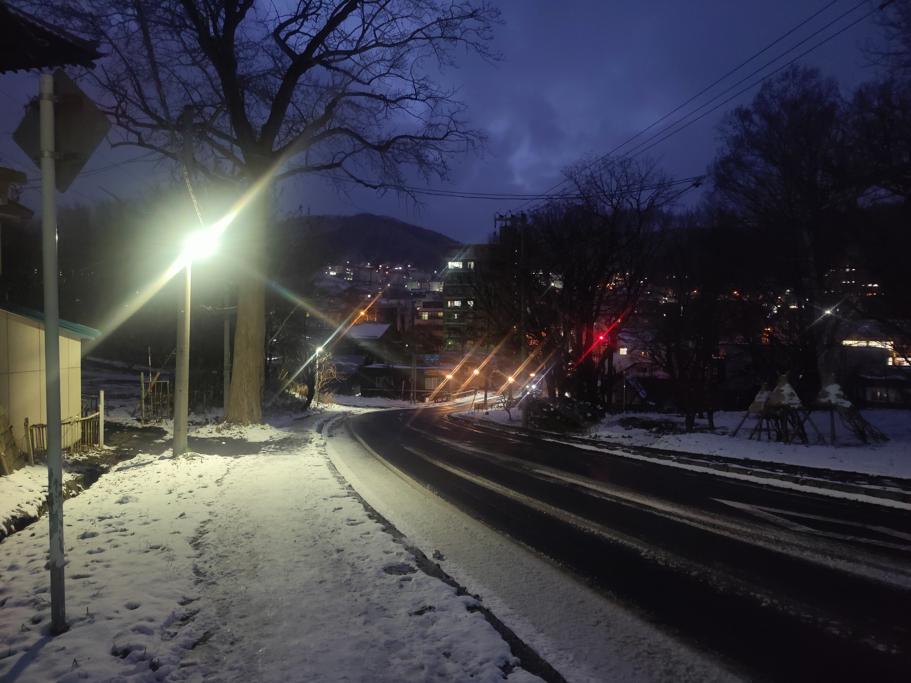

<link rel="stylesheet" href="./travels.css" />
# Hoshizora No Memoria
Hoshizora no Memoria [visual novel](https://vndb.org/v1474) IRL locations w/ tips
about traveling to the IRL locations.

## Google Map
<iframe src="https://www.google.com/maps/d/u/0/embed?mid=1gpdtOiV3EQxx-2Pv7z5JkuwulqBgBXw&ehbc=2E312F" width="640" height="480"></iframe>

## Otaru, Hokkaido
### Reccomended Itinerary
<figure class="inline"> 
  
  <figcaption>Original</figcaption>
</figure>
Estimated length: 2 days to get all day and night shots

From the airport, there is a express line from Shin-Sapporo straight to Otaru, which is
the last stop of the line. From there, a bike could be helpful, but in the winter it
is too dangerous and most of the challenge is from the climb so this is not absolutely
necessary. Start at the northern most point(1). I personally suggest starting here since 
this location will have the game start screen and the route ends on point 3 which
has the game's climax CG. Finally, do not underestimate how quickly the sun goes down
in Hokkaido in the winter.

??? "Hostel"
    I would reccomend [Little Barrel](https://g.co/kgs/SepontR). It's a two star
    hostel, but there a "room" that has a bed, table, and curtain instead of a regular
    door. I had no complains and was very cheap, ~$25/night.

 

### (!)Temiya Park

  <figure>
    
    <figcaption>Game CG</figcaption>
  </figure>

  <figure>
    
    <figcaption>Game CG</figcaption>
  </figure>
  <figure>
    
    <figcaption>Original</figcaption>
  </figure>

  <figure>
    
    <figcaption>Game CG</figcaption>
  </figure>
  <figure>
    
    <figcaption>Original</figcaption>
  </figure>

??? note "Snowy"
    <figure class="inline"> 
      
      <figcaption>Original</figcaption>
    </figure>
    Getting a photo without fog could take some patience and requires buffer time 
    in any trip plans.

??? note "Walking here"
    

      <figure>
        
        <figcaption>Original</figcaption>
      </figure>
      <figure>
        
        <figcaption>Original</figcaption>
      </figure>
    

    There's an unused railroads that has been turned into a pedestrian path that's 
    nice to walk on. Also beware that Temiya Park is big and there's only one spot
    that is free of trees. The Google map's location pin is very specific so please
    pay special attention.
    
### Otaru Inari Shrine

  <figure>
    
    <figcaption>Game CGs</figcaption>
  </figure>
  <figure>
    
    <figcaption>Original</figcaption>
  </figure>

This shrine is what most points to being the cannoncial shrine. However, in other
CGs this shrine is possibly too small and the next shrine below could also be an 
inspiration, espcially since there's no red walls here but the next shrine does have
red walls. 

??? note "Mamori"
    Coming into the shrine from the front, then to the left there should be a
    path to a smaller shrine office. From there, ring the bell and a nice
    grandma should be able to help get goods from this shrine, which could be 
    considered auxiliary goods of HoshiMemo.

### (!)Otaru Station

  <figure>
    
    <figcaption>Game CGs</figcaption>
  </figure>
  <figure>
    
    <figcaption>Original</figcaption>
  </figure>

This station does not look exactly the same as the CG, but instead served as an inspiration.

??? note "Animex"
    

      <figure>
        
        <figcaption>Original</figcaption>
      </figure>
      <figure>
        
        <figcaption>Original</figcaption>
      </figure>
      <figure>
        
        <figcaption>Original</figcaption>
      </figure>
    

    

      <figure>
        
        <figcaption>Original</figcaption>
      </figure>
      <figure>
        
        <figcaption>Original</figcaption>
      </figure>
      <figure>
        
        <figcaption><a href="https://x.com/favo_official/status/1786609157661221129/photo/1">Twitter</a></figcaption>
      </figure>
    

    There's a local anime store in Otaru that has partnered with Studio FAVORITE.
    There's many goods that is no longer availible online, but is still here.
    In particular, there's a photo card vending machine that I haven't seen any
    mention of online and please do post what the 3 secret photo cards are. The town
    is also very active in promotions via anime events. In 2024, I'm aware there was
    a Mea-tan party and a anime fest here.

### Otaru Port

  <figure>
    
    <figcaption>Game CGs</figcaption>
  </figure>
  <figure>
    
    <figcaption>Original</figcaption>
  </figure>
  <figure>
    
    <figcaption>Original</figcaption>
  </figure>

As of Nov 2024, the main building in the Game CG is being torn down. During the trip,
the demolition crane was moving, however in Google Street View as of summer of 2024,
the building was intact.

### Otaru Canal

  <figure>
    
    <figcaption>Game CG</figcaption>
  </figure>
  <figure>
    
    <figcaption>Original</figcaption>
  </figure>

  <figure>
    
    <figcaption>Game CG</figcaption>
  </figure>
  <figure>
    
    <figcaption>Original</figcaption>
  </figure>

Be sure to keep the building on the left size to get a more correct photo. The buildings
won't match perfectly since it has been so long since the game's original release.
Be sure to take your time as this is a popular spot, so my suggestion is to try to 
pre-frame the shot, then stand around where you want to take the shot until people
clear out.

??? failure "Mistakes"
    

      <figure>
        
        <figcaption>Original</figcaption>
      </figure>
      <figure>
        
        <figcaption>Original</figcaption>
      </figure>
    

    Here's some examples of what happens if you don't plan properly. First is a 
    framing failure, second is shows just how busy it can get.
    
### Otaru Music Box Museum

  <figure>
    
    <figcaption>Game CG</figcaption>
  </figure>
  <figure>
    
    <figcaption>Original</figcaption>
  </figure>
  <figure>
    
    <figcaption>Original</figcaption>
  </figure>

This location is also more of a inspiration than a direct match. The middle image
is from the 3rd floor and the second image is from the 2nd floor.

??? note "Nearby historic district"
    

      <figure>
        
        <figcaption>Original</figcaption>
      </figure>
      <figure>
        
        <figcaption>Original</figcaption>
      </figure>
    

    This museum is in the middle of historic district. Nearby, there a clock that
    runs on steam and just some beautiful sights at night.
    
### (!)Sumiyoshi Shrine

  <figure>
    
    <figcaption>Game CG</figcaption>
  </figure>
  <figure>
    
    <figcaption>Game CG</figcaption>
  </figure>

  <figure>
    
    <figcaption>Game CG</figcaption>
  </figure>
  <figure>
    
    <figcaption>Game CG</figcaption>
  </figure>

  <figure>
    
    <figcaption><a href="http://blog.livedoor.jp/brompton_traveling/archives/24668928.html">Blog</a></figcaption>
  </figure>
  <figure>
    
    <figcaption><a href="http://blog.livedoor.jp/brompton_traveling/archives/24668928.html">Blog</a></figcaption>
  </figure>

This shrine is the bigger and more central shrine, that another article has mentioned.

??? note "Festivals"
    There is a festival held here around July which would also fit the themes of the visual novel.

### Momiji Bridge Slope

  <figure>
    
    <figcaption>Game CG</figcaption>
  </figure>
  <figure>
    
    <figcaption>Original</figcaption>
  </figure>
  <figure>
    
    <figcaption>Original</figcaption>
  </figure>

### (!)Asahi Observation Deck

  <figure>
    
    <figcaption>Game CG</figcaption>
  </figure>
  <figure>
    
    <figcaption>Original</figcaption>
  </figure>

  <figure>
    
    <figcaption>Original</figcaption>
  </figure>
  <figure>
    
    <figcaption>Original</figcaption>
  </figure>

<figure>
  
  <figcaption>Original</figcaption>
</figure>

  <figure>
    
    <figcaption>Game CG</figcaption>
  </figure>
  <figure>
    
    <figcaption>Original</figcaption>
  </figure>

  <figure>
    
    <figcaption>Game CG</figcaption>
  </figure>
  <figure>
    
    <figcaption>Original</figcaption>
  </figure>
  <figure>
    
    <figcaption>Game CG</figcaption>
  </figure>

  <figure>
    
    <figcaption>Game CG</figcaption>
  </figure>
  <figure>
    
    <figcaption><a href="http://blog.livedoor.jp/brompton_traveling/archives/24668928.html">Blog</a></figcaption>
  </figure>

  <figure>
    
    <figcaption>Game CG</figcaption>
  </figure>
  <figure>
    
    <figcaption>Game CG</figcaption>
  </figure>
  <figure>
    
    <figcaption>Game CG</figcaption>
  </figure>

This location has the most CGs. If you have extra time, consider taking a break here
and maybe even get some studying here. 

### (!)Around Asahi Observation Deck

  <figure>
    
    <figcaption>Game CG</figcaption>
  </figure>
  <figure>
    
    <figcaption>Game CG</figcaption>
  </figure>

I would consider some more generic shots to be taken around the observation deck
and simply imagine the characters infront of myself. 

??? note "Winter time"
    In the winter time, car traffic is closed off, but there's still locals that 
    would walk up this path. Moreover, there's a few pieces of art that gets covered
    up during winter, so pay attention to not distrub anything here. Because of this
    artwork to get the Game CG to match with the IRL photo, the other side of the
    deck has to be used and in post mirror the image.

??? note "Next Time"
    - Visit Animex again for more photo cards
    - Get sakura blossom photo

## Saitama
### (!)Saitama Municipal Youth Astronomical Museum

  <figure>
    
    <figcaption>Game CG</figcaption>
  </figure>
  <figure>
    
    <figcaption>Original</figcaption>
  </figure>
  <figure>
    
    <figcaption>Game CG</figcaption>
  </figure>

The CG is from the inside of the astronomy building, so any room should be fine.

### Tokyo University of Science Noda Campus

  <figure>
    
    <figcaption>Game CG</figcaption>
  </figure>
  <figure>
    
    <figcaption><a href="https://rinnow.hatenablog.com/entry/hoshimemo">Blog</a></figcaption>
  </figure>

This is from inside the campus, so I personally would not go there with my limited
japanese to avoid trouble or any chance of trespassing. According to the [blog](https://rinnow.hatenablog.com/entry/hoshimemo),
the campus was renovated which is why it looks different now.

## Koichi
### (!)Cafe Faust

  <figure>
    
    <figcaption>Game CG</figcaption>
  </figure>
  <figure>
    
    <figcaption><a href="https://rinnow.hatenablog.com/entry/hoshimemo">Blog</a></figcaption>
  </figure>

  <figure>
    
    <figcaption>Game CG</figcaption>
  </figure>
  <figure>
    
    <figcaption>Game CG</figcaption>
  </figure>

Also according to the [blog](https://rinnow.hatenablog.com/entry/hoshimemo) this spot
was found by fans many years later. I would also consider the following CG to also
be a part of the inside of the cafe given the context.

## Sources
- [https://rinnow.hatenablog.com/entry/hoshimemo](https://rinnow.hatenablog.com/entry/hoshimemo)
- [https://dotproducer.kan-be.com/seiti/hoshizora/hoshizora.html](https://dotproducer.kan-be.com/seiti/hoshizora/hoshizora.html)
- [https://dtman.info/post-5292/](https://dtman.info/post-5292/)
- [http://blog.livedoor.jp/brompton_traveling/archives/27601534.html](http://blog.livedoor.jp/brompton_traveling/archives/27601534.html)
- [http://blog.livedoor.jp/brompton_traveling/archives/24668928.html](http://blog.livedoor.jp/brompton_traveling/archives/24668928.html)
- [https://cheat-ie.hatenablog.com/entry/2021/08/31/201455](https://cheat-ie.hatenablog.com/entry/2021/08/31/201455)

<!-- * List of Scenes -->
<!-- |                      | Ani-ref | Reg-ref | Src   |     My-ref | Incomplete | Peronsal | Map | -->
<!-- | Start screen         |      31 |         |       |            | X          |          | X   | -->
<!-- | +Night               |      30 |         |       |         60 |            |          | X   | -->
<!-- | +Snow                |      29 |         |       |         40 |            |          | X   | -->
<!-- | +Foggy Snow          |         |         |       |         39 |            |          | X   | -->
<!-- | Train walkway        |         |         |       |         37 |            | X        | X   | -->
<!-- | Map                  |         |         |       |         38 |            | X        | X   | -->
<!-- |                      |         |         |       |            |            |          | X   | -->
<!-- | Shrine(first)        |      10 |         |       |         41 |            |          | X   | -->
<!-- |                      |         |         |       |            |            |          | X   | -->
<!-- | Station              |       8 |         |       |         47 |            |          | X   | -->
<!-- | Animex               |         |         |       |  45+46, 62 |            | X        | X   | -->
<!-- | Shopping district    |         |         |       | 44, 71, 72 |            | X        | X   | -->
<!-- |                      |         |         |       |            |            |          | X   | -->
<!-- | Port                 |       9 |         |       |      42+43 |            |          | X   | -->
<!-- | Canal                |      11 |         |       |      48-50 |            |          | X   | -->
<!-- | +Night               |       5 |         |       |         51 |            |          | X   | -->
<!-- | Little music box     |      12 |         |       |       52+3 |            |          | X   | -->
<!-- | Historic district    |         |         |       |         36 |            | X        | X   | -->
<!-- | Fun clock            |         |         |       |         54 |            | X        | X   | -->
<!-- |                      |         |         |       |            |            |          | X   | -->
<!-- | Suspected Shrine     |   17/68 |       3 | tag-1 |            | X          |          | X   | -->
<!-- | +Night ver.          |       4 |      18 | tag-1 |            | X          |          | X   | -->
<!-- | +Fest ver.           |      34 |         |       |            | X          |          | X   | -->
<!-- |                      |         |         |       |            |            |          | X   | -->
<!-- | Bridge               |      13 |         |       |      55+56 |            |          | X   | -->
<!-- |                      |         |         |       |            |            |          | X   | -->
<!-- | Observatory          |      14 |         |       |   57-59,63 |            |          | X   | -->
<!-- | +Tilt outside        |      27 |         |       |         64 |            |          | X   | -->
<!-- | +Balcony             |      15 |         |       |            | X          |          | X   | -->
<!-- | +Balcony-night       |       2 |         |       |         65 |            |          | X   | -->
<!-- | +Balcony-night-CG    |       1 |      20 | tag-1 |            |            |          | X   | -->
<!-- | +Hug                 |      25 |         |       |            | X          |          | X   | -->
<!-- | +Portrait            |      26 |         |       |            | X          |          | X   | -->
<!-- | +Leaning out fisheye |      24 |         |       |            | X          |          | X   | -->
<!-- | +Night sky           |      67 |         |       |            | X          |          | X   | -->
<!-- | Sakura Blossoms      |      23 |         |       |            | X          |          | X   | -->
<!-- |                      |         |         |       |            |            |          | X   | -->
<!-- | Astronomy            |       7 |         |       |         61 |            |          | X   | -->
<!-- | +Inside              |      35 |         |       |            |            |          | X   | -->
<!-- | Tokyo Uni            |       6 |      21 | owl   |            |            |          | X   | -->
<!-- |                      |         |         |       |            |            |          | X   | -->
<!-- | Koichi Cafe          |      16 |      22 | owl   |            | X          |          | X   | -->
<!-- | +Inside              |      33 |         |       |            | X          |          | X   | -->
<!-- | +Close up CG         |      32 |         |       |            | X          |          | X   | -->
<!-- ** Src-tags -->
<!-- 1: http://blog.livedoor.jp/brompton_traveling/archives/24668928.html -->
